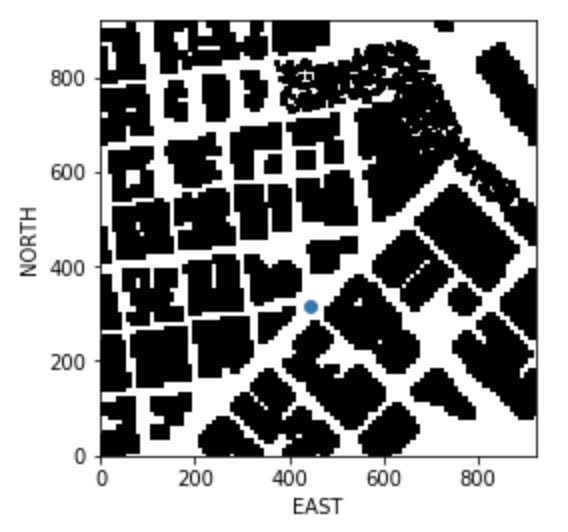

## Project: 3D Motion Planning


---

## [Rubric](https://review.udacity.com/#!/rubrics/1534/view) Points
### Here I will consider the rubric points individually and describe how I addressed each point in my implementation.  

---
### Writeup / README

### Explain the Starter Code

#### 1. Explain the functionality of what's provided in `motion_planning.py` and `planning_utils.py`
These scripts contain a basic planning implementation that includes:
1. `motion_planning.py` that provides the functionality of controlling the drone using event-driven approch. It handles the state transitions and callbacks and sending commands like take off and arm/disarm and change position. The `plan_path` is the most important function because it calculate the obstacles and the waypoints.
2. `planning_utils` that provides 2 main functionalities: `create_grid` creates a 2D grid from the colliders data and it can be modified to create a 2.5D grid. `a_star` that finds the path thrgouh the obstacles using A* algorithm given a heuristic function that can be modified to a different heuristic function and possible actions that also can be modifed to support for example diagonal moves.
3. `colliders.csv` that contains the global home position and the positions of all obstacles.

### Implementing Your Path Planning Algorithm

#### 1. Set your global home position
Here I should read the first line of the csv file, extract lat0 and lon0 as floating point values and use the self.set_home_position() method to set global home. Explain briefly how you accomplished this in your code.
1. First reading the first record from `colliders.csv`:
```python
with open(filename, 'r') as f:
    lat_lon = f.readline()
    lat_lon = [y for x in lat_lon.split(", ") for y in x.split(" ")]
    lat = float(lat_lon[1])
    lon = float(lat_lon[3])
```
2. Then set the home position:
```python
self.set_home_position(lon0, lat0, TARGET_ALTITUDE)
```


And here is picture of the home position on the map


#### 2. Set your current local position
Now, I need to convert the global drone position to a local position:
```python
current_local_pos = global_to_local(global_position, self.global_home)
```


#### 3. Set grid start position from local position
This is another step in adding flexibility to the start location. I defined functions `local_position_to_grid`:
```python
def local_position_to_grid(local_pos, grid_centre):
    return (
        grid_centre[0] + int(local_pos[0]),
        grid_centre[1] + int(local_pos[1])
    )
```
Then set the variable `drone_start` to the current dron position on the grid:
```python
drone_start = local_position_to_grid(current_local_pos, grid_centre)
```

#### 4. Set grid goal position from geodetic coords
This step is to add flexibility to the desired goal location. Should be able to choose any (lat, lon) within the map and have it rendered to a goal location on the grid. I defined function `calulate_grid_goal`:
```python
def calulate_grid_goal(lon, lat, alt, grid_centre, global_home):
    local_pos = global_to_local((lon, lat, alt), global_home)
    return local_position_to_grid(local_pos, grid_centre)
```
Then I can convert any latitude, longitude, altitude to a grid position:
```python
grid_goal = calulate_grid_goal(lon, lat, alt, grid_centre, self.global_home)
```

#### 5. Modify A* to include diagonal motion (or replace A* altogether)
In this version, I only added the diagonal moves by adding those 4 actions:
```python
    NW = (-1, -1, np.sqrt(2))
    NE = (-1, 1, np.sqrt(2))
    SW = (1, -1, np.sqrt(2))
    SE = (1, 1, np.sqrt(2))
```
Then modefied `valid_actions` function to provide a geniric check for any defined actions instead of applying actions by hard-coded values:
```python
def valid_actions(grid, current_node):
    """
    Returns a list of valid actions given a grid and current node.
    """
    n, m = grid.shape[0] - 1, grid.shape[1] - 1
    x, y = current_node

    # check if the node is off the grid or
    # it's an obstacle
    valid_actions = []
    for action in list(Action):
        delta = action.delta
        # Apply the action and check if it hits an obstacle.
        (x1, y1) = (x + delta[0], y + delta[1])
        if x1 > n:
            continue

        if y1 > m:
            continue

        if grid[(x1, y1)] == 1:
            continue

        valid_actions.append(action)

    return valid_actions
```
This is an image showing a plan from position `(0,0)` to `(920,920)` (start of grid to end of grid) with diagonal moves:


#### 6. Cull waypoints 
For this version, I used a simple path pruning technique that only checks foreach point if the next 2 points or almost on the same line and remove the one in the middle.
```python
def collinearity_check(p1, p2, p3, epsilon=1e-6):
    m = np.concatenate((p1, p2, p3), 0)
    det = np.linalg.det(m)
    return abs(det) < epsilon


def prune_path(path):
    pruned_path = [p for p in path]
    i = 0
    while i < len(pruned_path) - 2:
        p1 = point(pruned_path[i])
        p2 = point(pruned_path[i + 1])
        p3 = point(pruned_path[i + 2])
        if collinearity_check(p1, p2, p3):
            pruned_path.remove(pruned_path[i + 1])

        else:
            i += 1

    return pruned_path
```
Then create the waypoints out of that pruned path instead of the full path:
```python
waypoints = [[p[0] + north_offset, p[1] + east_offset, TARGET_ALTITUDE, 0] for p in prune_path(path)]
```


### Execute the flight
#### 1. Does it work?
It works!


Here's a picture of my drone flying accoarding to the plan!


# Extra Challenges: Real World Planning
Next steps is to improve the planning by introducing the 2.5D grid to allow flying over short objects, using ray tracing to remove useless waypoints and moveing from grid to graph.


